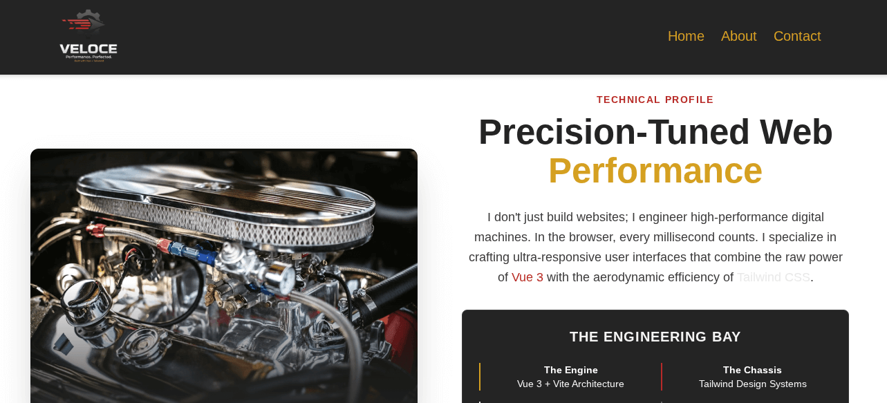

# VELOCE – High-Performance Portfolio Framework

Veloce is a modern portfolio framework built with Vue 3 and Tailwind CSS.
It focuses on performance, responsive design, and a clean interface suitable for developer portfolios and technical showcases.

Live Demo
[https://racing.succeedhost.com/](https://racing.succeedhost.com/)

Repository
[https://github.com/succeedhost-com/racing-team](https://github.com/succeedhost-com/racing-team)

---

## Preview



---

## Tech Stack

| Component  | Technology              | Purpose                                      |
| ---------- | ----------------------- | -------------------------------------------- |
| Framework  | Vue 3 (Composition API) | Reactive UI and application logic            |
| Styling    | Tailwind CSS            | Utility-first design system                  |
| Routing    | Vue Router              | Single-page navigation                       |
| Build Tool | Vite                    | Fast development server and optimized builds |
| Theme      | CSS Variables           | Centralized design tokens                    |

---

## Key Features

* Custom design system using a structured color palette
* Fully responsive layout built with a mobile-first approach
* Modular Vue components for maintainability
* Animated navigation interface
* Modern UI elements including glass-style cards and responsive layouts
* Optimized build output with minimal CSS overhead

---

## Project Structure

```
racing-team/

├── public/        Static assets
├── src/
│   ├── components Reusable UI components
│   ├── views      Page-level views
│   ├── router     Vue Router configuration
│   └── assets     CSS and images
├── index.html
└── vite.config.js
```

---

## Getting Started

### Clone the Repository

git clone [https://github.com/succeedhost-com/racing-team.git](https://github.com/succeedhost-com/racing-team.git)
cd racing-team

### Install Dependencies

npm install

### Run the Development Server

npm run dev

### Build for Production

npm run build

---

## Theme Configuration

Color tokens are defined using CSS variables.
Update these values to customize the theme.

:root {
--color-racing: #ff4d4d;
--color-mint: #b2ffda;
--color-carbon: #1a1a1a;
--color-platinum: #f5f5f7;
}

---

## Author

Jim W.

LinkedIn
[https://www.linkedin.com/in/jw-technology](https://www.linkedin.com/in/jw-technology)

Portfolio
[https://succeedhost.com](https://succeedhost.com)

---

## License

This project is licensed under the MIT License.
